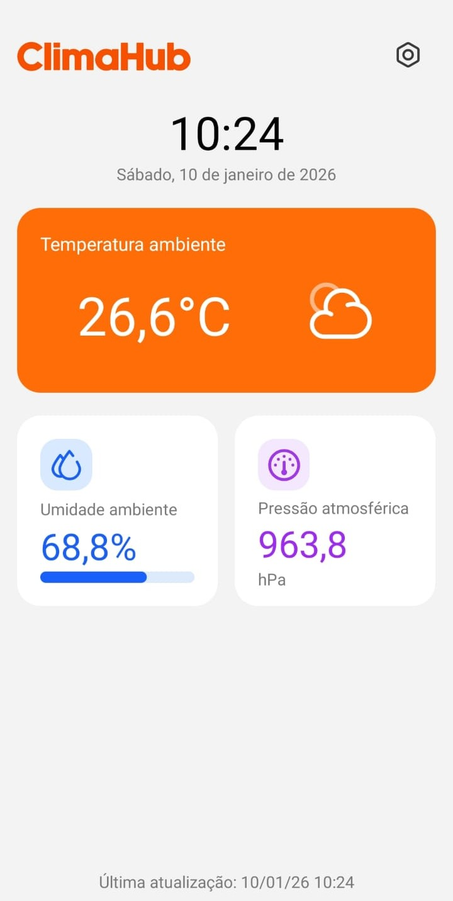
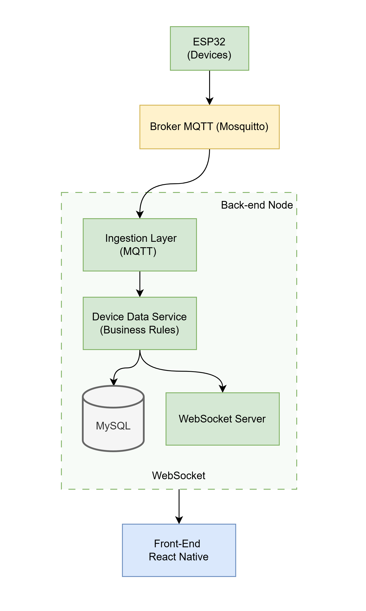

# 🌤️ ClimaHub — Plataforma IoT para Coleta e Visualização de Dados Ambientes

O **ClimaHub** é uma aplicação IoT completa para coleta, processamento, armazenamento e visualização em tempo real de dados ambientais, utilizando ESP32, MQTT, WebSocket, banco de dados relacional e um aplicativo mobile em React Native.

O projeto foi desenvolvido com foco em arquitetura desacoplada, boas práticas de backend e comunicação em tempo real, servindo tanto como solução funcional quanto como projeto de portfólio.

### 🏠 Tela principal do sistema



---

## 🧠 Visão Geral da Arquitetura

O sistema é composto por quatro grandes camadas:

1.  **Dispositivos IoT:** ESP32 + sensores.
2.  **Broker de Mensageria:** MQTT.
3.  **Backend:** Ingestão, regras de negócio, persistência e tempo real.
4.  **Frontend Mobile:** Visualização dos dados.

### Fluxo de Dados



---

## 📨 Broker MQTT

- Broker Mosquitto

- Executado via Docker

- Responsável por:

  - Receber dados dos dispositivos
  - Distribuir mensagens para consumidores

- Tópicos organizados por domínio, ex:

```text
weather/esp32_heitor/data
```

📌 O uso de MQTT garante:

- Baixo consumo de banda
- Comunicação assíncrona
- Desacoplamento entre dispositivos e backend

---

### 🧩 Backend (Node.js + TypeScript)

O backend atua como o **núcleo da aplicação**, sendo responsável por:

### 🔌 Ingestion Layer

- Cliente MQTT que:
  - Se inscreve nos tópicos
  - Valida o payload recebido
  - Converte os dados para entidades de domínio

### 📐 Camada de Domínio

- `Device Data Service` (ou `ReadingService`)
- Centraliza regras de negócio:
  - Validação de dados
  - Associação com dispositivos
  - Orquestra persistência e eventos em tempo real

### 🗄️ Persistência

- Banco **MySQL**
- Executado via **Docker**
- Armazena histórico de leituras para relatórios e análises futuras

### ⚡ Real-time Gateway

- Servidor **WebSocket**
- Transmite leituras em tempo real para clientes conectados
- Evita polling e reduz latência no frontend

---

### 📱 Frontend Mobile (React Native)

- Aplicativo desenvolvido em **React Native**
- Consome dados via:
  - **WebSocket** → dados atuais em tempo real
  - **HTTP (futuro)** → histórico e relatórios
- Exibe:
  - Temperatura
  - Umidade
  - Pressão atmosférica
- Atualizações instantâneas conforme novas leituras chegam

---

## 🔄 Comunicação entre Componentes

| Comunicação        | Tecnologia | Motivo                           |
| ------------------ | ---------- | -------------------------------- |
| ESP32 → Backend    | MQTT       | Leve, assíncrono, ideal para IoT |
| Backend → Frontend | WebSocket  | Tempo real, baixa latência       |
| Backend → Banco    | MySQL      | Persistência confiável           |
| Frontend → Backend | HTTP       | Consulta de dados históricos     |

---

## 🌐 Configuração do ESP32

Caso o ESP32 não consiga se conectar a uma rede Wi-Fi salva:

- Ele entra automaticamente em **modo AP**
- Cria uma rede Wi-Fi própria
- Disponibiliza endpoints HTTP para:
  - Configurar SSID e senha
  - Configurar broker MQTT
- As configurações são salvas em **NVS (Preferences)**

Isso elimina a necessidade de regravar firmware para trocar de rede.

---

## 🧪 Tecnologias Utilizadas

### Hardware

- ESP32
- BME280

### Backend

- Node.js
- TypeScript
- MQTT.js
- WebSocket
- MySQL
- Docker

### Frontend

- React Native
- Expo
- WebSocket API

---

## 🎯 Objetivo do Projeto

Este projeto foi desenvolvido com o objetivo de:

- Praticar **arquitetura de sistemas distribuídos**
- Trabalhar com **IoT e comunicação assíncrona**
- Implementar **tempo real no frontend**
- Criar um projeto de portfólio próximo de cenários reais de mercado
